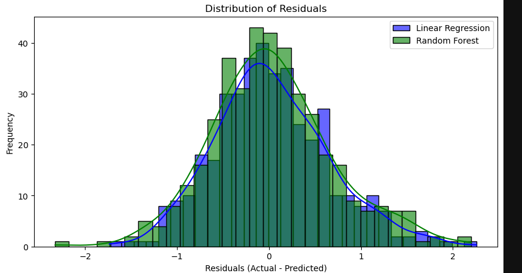
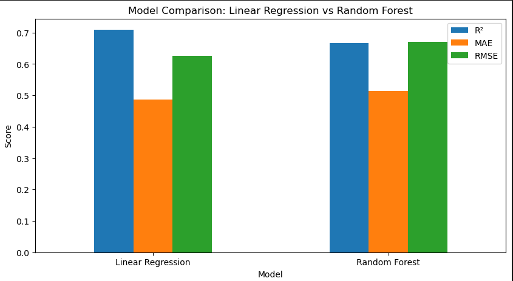
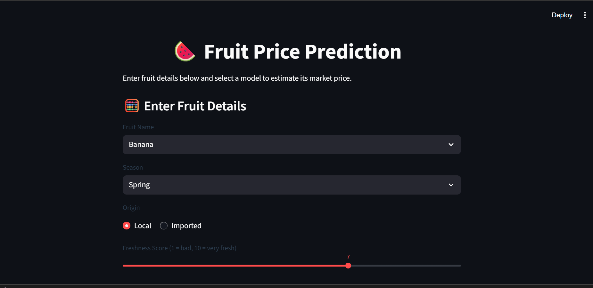
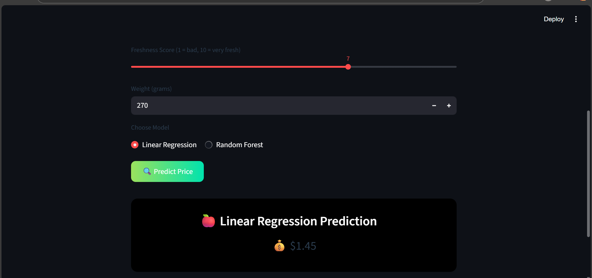
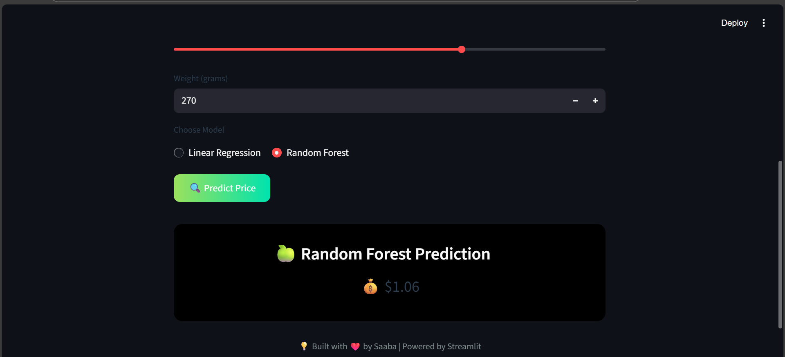

# 🥝 Fruit Price Prediction — Machine Learning Project
### HamiSkills Internship • Week 2 Task – Machine Learning Track

This project predicts the **price of fruits** based on their features such as weight, freshness, season, and origin.  
It was developed as part of the **HamiSkills Machine Learning Track (Week 2)** to practice data preprocessing, regression modeling, evaluation, and Streamlit deployment.

---

### 📖 **Project Overview**

Hami MiniMarket wants to optimize pricing and inventory decisions.  
Your task is to build a regression model that predicts fruit prices based on:  
`fruit_name`, `weight`, `freshness_score`, `season`, and `origin`.

---

### 🗂️ **Dataset**

- **Source:** Synthetic dataset created for this project (Hami MiniMarket simulation).  
- **File:** `dataset/fruit_dataset.csv` and an encoded version `dataset/Clean_fruit_dataset_encoded.csv`.
- **Samples:** 1,999 rows.  
- **Columns:** `fruit_name`, `weight`, `freshness_score`, `season`, `origin`, `price`.

### 🧠 **Machine Learning Pipeline**

#### 1️⃣ **Data Preprocessing**
- Removed duplicates and handled missing values  
- Filled numeric columns with **median** and categorical with **mode**  
- Performed **one-hot encoding** for categorical features:  
  - `fruit_name`, `season`, and `origin`

#### 2️⃣ **Feature Set**
| Feature | Description |
|----------|--------------|
| `fruit_name` | Type of fruit (Apple, Banana, etc.) |
| `weight` | Fruit weight in kilograms |
| `freshness_score` | Scale 1–10 (freshness level) |
| `season` | Season of availability (Spring, Summer, Autumn, Winter) |
| `origin` | Local or Imported |
| `price` | Target variable (USD) |

#### 3️⃣ **Modeling**
Trained and compared:
- **Linear Regression**
- **Random Forest Regressor (n_estimators=100)**

#### 4️⃣ **Evaluation Metrics**
| Metric | Linear Regression | Random Forest |
|---------|------------------:|---------------:|
| MAE | ~ 0.49 | ~0.51 |
| RMSE | ~0.63 | ~0.67 |
| R² |  0.709 |  0.666 |

✅ **Random Forest performed best** and was chosen for deployment.

---

### 📊 **Visualizations**
- Scatter plot: Predicted vs Actual Prices  
- Distribution plot of residuals  
- Model comparison chart (Linear Regression vs Random Forest)





---

### 💻 **Streamlit App**
A professional, user-friendly web app was built to:
- Let users enter **fruit name, season, origin, freshness score, and weight (grams)**  
- Choose a **model (Linear Regression or Random Forest)**  
- Instantly get a **predicted price**  

#### 🖥️ Run Locally
```bash
cd client
streamlit run app.py
```

#### Screenshot :




---

### 📂 **Project Structure**
```
fruit-price-prediction-ML/
│
├── dataset/
│   ├── clean_fruit_dataset.csv
│   └── fruit_dataset.csv
│
├── model/
│   ├── lr_fruit_model.pkl
│   └── rf_fruit_model.pkl
│
├── client/
│   └── app.py           # Streamlit app
│
├── code
│    └──fruit_price_prediction.ipynb   # Main notebook
└── README.md
```


---


### 🧑‍💻 **Developed by**
**Saabirin Mire Abukar**  
HamiSkills Machine Learning Intern  

